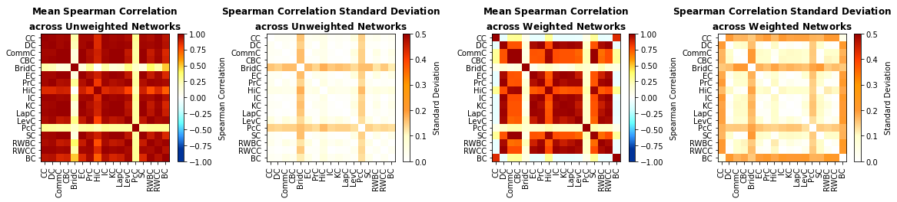

# CENTRALITY MEASURES CORRELATION ANALYSIS
This has been made as a homework of the ITU - Graph Theory course. This repository provides an experimental analysis script for following paper:



> **Consistency and Differences Between Centrality Measures Across Distinct Classes of Networks**<br/>
> Stuart Oldham, Ben Fulcher, Linden Parkes, Aurina Arnatkeviciute, Chao Suo, Alex Fornito<br/>
>
> **Abstract:** *The roles of different nodes within a network are often understood through centrality analysis, which aims to quantify the capacity of a node to influence, or be influenced by, other nodes via its connection topology. Many different centrality measures have been proposed, but the degree to which they offer unique information, and such whether it is advantageous to use multiple centrality measures to define node roles, is unclear. Here we calculate correlations between 17 different centrality measures across 212 diverse real-world networks, examine how these correlations relate to variations in network density and global topology, and investigate whether nodes can be clustered into distinct classes according to their centrality profiles. We find that centrality measures are generally positively correlated to each other, the strength of these correlations varies across networks, and network modularity plays a key role in driving these cross-network variations. Data-driven clustering of nodes based on centrality profiles can distinguish different roles, including topological cores of highly central nodes and peripheries of less central nodes. Our findings illustrate how network topology shapes the pattern of correlations between centrality measures and demonstrate how a comparative approach to network centrality can inform the interpretation of nodal roles in complex networks.*

## Running the Analysis

You can run the analysis.ipynb notebook file to execute full analysis that the paper contains.

# Please cite the original paper when using the content:

```latex
@article{DBLP:journals/corr/abs-1805-02375,
  author    = {Stuart Oldham and
               Ben D. Fulcher and
               Linden Parkes and
               Aurina Arnatkeviciute and
               Chao Suo and
               Alex Fornito},
  title     = {Consistency and differences between centrality metrics across distinct
               classes of networks},
  journal   = {CoRR},
  volume    = {abs/1805.02375},
  year      = {2018},
  url       = {http://arxiv.org/abs/1805.02375},
  archivePrefix = {arXiv},
  eprint    = {1805.02375},
  timestamp = {Mon, 13 Aug 2018 16:46:54 +0200},
  biburl    = {https://dblp.org/rec/journals/corr/abs-1805-02375.bib},
  bibsource = {dblp computer science bibliography, https://dblp.org}
}
```